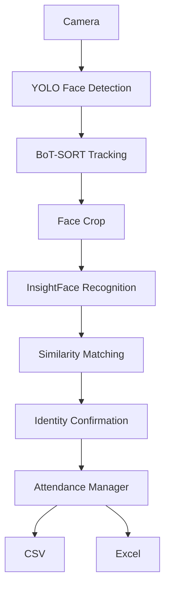
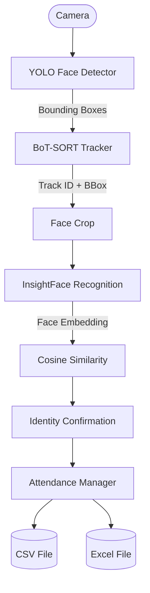
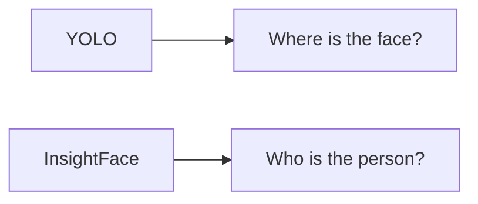
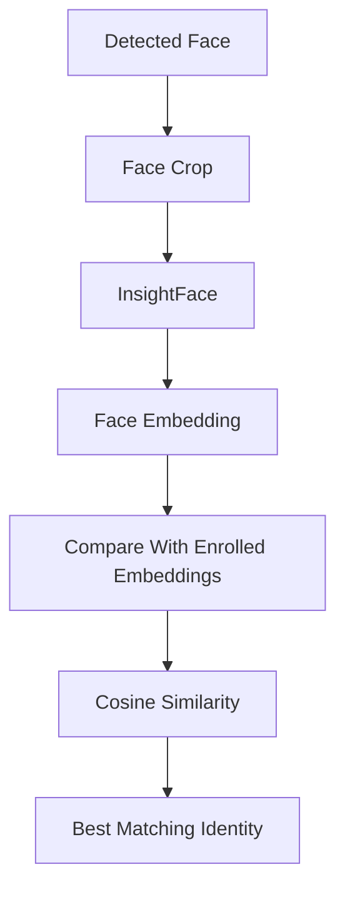
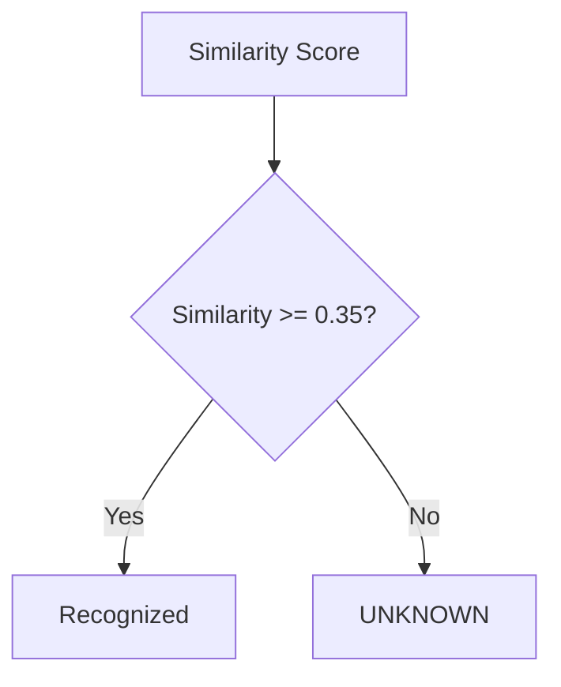
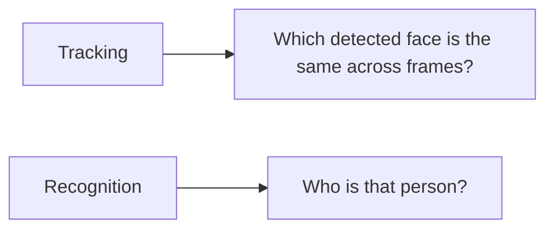
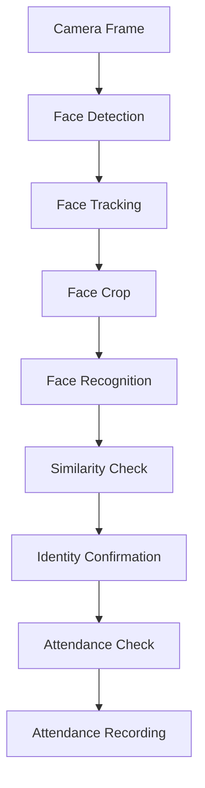
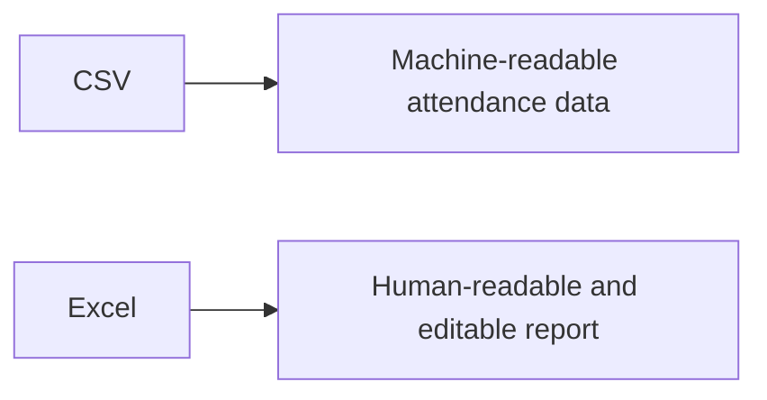
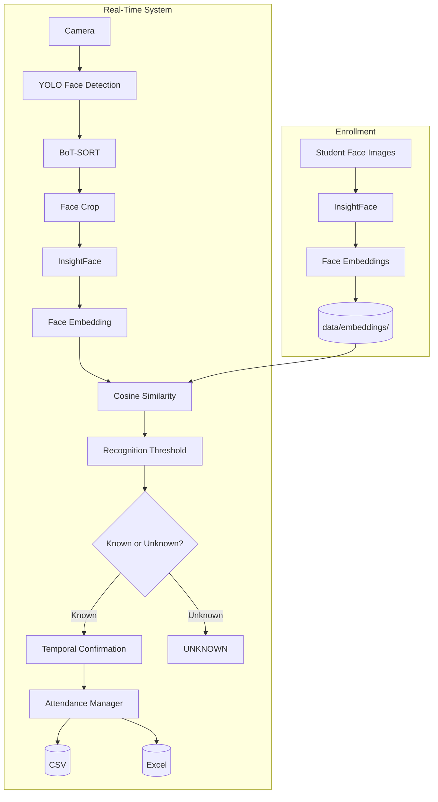

# Real-Time Face Recognition Attendance System

A real-time face recognition attendance system that uses computer vision and deep learning to automatically identify students and record their attendance through a camera.

---

## Table of Contents

- [Overview](#overview)
- [Features](#features)
- [Architecture](#architecture)
- [Component Responsibilities](#component-responsibilities)
- [Project Structure](#project-structure)
- [Requirements](#requirements)
- [Installation](#installation)
- [YOLO Face Detection Model](#yolo-face-detection-model)
- [Face Enrollment](#face-enrollment)
- [Face Recognition](#face-recognition)
- [Recognition Threshold](#recognition-threshold)
- [Recognition Evaluation](#recognition-evaluation)
- [Temporal Confirmation](#temporal-confirmation)
- [Face Tracking](#face-tracking)
- [Running the Attendance System](#running-the-attendance-system)
- [Attendance Management](#attendance-management)
- [CSV Attendance Storage](#csv-attendance-storage)
- [Excel Attendance Report](#excel-attendance-report)
- [Testing](#testing)
- [GPU Acceleration](#gpu-acceleration)
- [Configuration](#configuration)
- [Privacy](#privacy)
- [Git Ignore Policy](#git-ignore-policy)
- [Technologies Used](#technologies-used)
- [End-to-End Workflow](#end-to-end-workflow)
- [Limitations](#limitations)
- [Future Improvements](#future-improvements)

---

## Overview

The system combines three major computer vision components:

- **YOLO** — detects faces in the camera frame.
- **BoT-SORT** — tracks detected faces across frames.
- **InsightFace** — recognizes the identity of each detected face.

The complete pipeline is:



Detection, tracking, recognition, and attendance management are kept as separate stages so that each component can be tested and improved independently.

---

## Features

- Real-time webcam face detection
- Multiple-face detection
- Multi-person tracking using BoT-SORT
- Face recognition using InsightFace
- GPU-accelerated inference
- Automatic face enrollment
- Automatic face embedding generation
- Cosine similarity based recognition
- Recognition threshold
- Temporal recognition confirmation
- Unknown-person rejection
- Duplicate attendance prevention
- Date-wise attendance records
- Automatic Excel attendance generation
- CSV attendance storage
- Recognition evaluation
- Separate component tests

---

## Architecture



---

## Component Responsibilities

| Component | Responsibility |
|---|---|
| YOLO | Detects where faces are located |
| BoT-SORT | Tracks the same face across video frames |
| InsightFace | Identifies who the person is |
| Cosine Similarity | Compares face embeddings |
| Recognition Threshold | Determines known vs unknown |
| Temporal Confirmation | Confirms recognition across multiple frames |
| Attendance Manager | Records attendance and prevents duplicates |
| CSV | Stores raw attendance records |
| Excel | Provides a human-readable attendance report |

---

## Project Structure

```text
face_attendance/
│
├── models/
│   └── yolov11n-face.pt
│
├── data/
│   ├── enrolled_faces/
│   │   ├── student_1/
│   │   ├── student_2/
│   │   └── ...
│   │
│   ├── embeddings/
│   │   ├── student_1.npy
│   │   ├── student_2.npy
│   │   └── ...
│   │
│   └── attendance/
│       ├── attendance.csv
│       └── attendance.xlsx
│
├── src/
│   ├── __init__.py
│   │
│   ├── detector/
│   │
│   ├── tracker/
│   │   ├── __init__.py
│   │   └── tracker.py
│   │
│   ├── recognition/
│   │   ├── __init__.py
│   │   ├── recognizer.py
│   │   └── enrollment.py
│   │
│   ├── attendance/
│   │   ├── __init__.py
│   │   ├── attendance_manager.py
│   │   └── excel_generator.py
│   │
│   └── main.py
│
├── test/
│   ├── __init__.py
│   ├── test_detector.py
│   ├── test_recognition.py
│   ├── test_attendance.py
│   └── eval_recognition.py
│
├── .gitignore
├── requirements.txt
└── README.md
```

---

## Requirements

### Hardware

- Webcam
- Computer capable of running Python
- NVIDIA GPU recommended for real-time GPU acceleration

### Software

- Python 3.x
- OpenCV
- Ultralytics
- PyTorch
- InsightFace
- ONNX Runtime GPU
- NumPy
- OpenPyXL

All required Python packages are listed in `requirements.txt`.

---

## Installation

### 1. Clone the Repository

```bash
git clone <YOUR_GITHUB_REPOSITORY_URL>
cd face_attendance
```

### 2. Create a Virtual Environment

```bash
python -m venv my_env
```

Activate the environment on Windows:

```bash
my_env\Scripts\activate
```

### 3. Install Dependencies

```bash
pip install -r requirements.txt
```

---

## YOLO Face Detection Model

The project uses the following face detection model:

```text
models/yolov11n-face.pt
```

The model is responsible for detecting the location of faces.

It does not identify the person.

The responsibilities are separated as follows:



Place the model inside the `models` directory before running the application.

---

## Face Enrollment

Face enrollment creates a reference embedding for each student.

### Folder Structure

Create a folder for every student inside:

```text
data/enrolled_faces/
```

Example:

```text
data/
└── enrolled_faces/
    ├── krish/
    │   ├── image1.jpg
    │   ├── image2.jpg
    │   └── image3.jpg
    │
    ├── balaji/
    │   ├── image1.jpg
    │   └── image2.jpg
    │
    └── niresh/
        ├── image1.jpg
        └── image2.jpg
```

The folder name is used as the student's identity.

For example:

```text
data/enrolled_faces/krish/
```

represents the student:

```text
krish
```

### Generate Embeddings

Run:

```bash
python src/recognition/enrollment.py
```

The enrollment process:

1. Finds all student folders.
2. Reads all supported images.
3. Detects faces using InsightFace.
4. Skips images where no face is detected.
5. Skips images containing multiple faces.
6. Generates embeddings for valid images.
7. Combines the valid embeddings for each student.
8. Normalizes the final embedding.
9. Saves the final embedding as a `.npy` file.

Generated embeddings are stored in:

```text
data/embeddings/
```

Example:

```text
data/embeddings/
├── krish.npy
├── balaji.npy
└── niresh.npy
```

---

## Face Recognition

InsightFace generates a numerical representation of each detected face called a face embedding.

The recognition process is:



The system compares the detected face embedding with the stored embeddings of enrolled students.

The identity with the highest similarity is selected.

If the similarity does not satisfy the recognition threshold, the person is classified as:

```text
UNKNOWN
```

---

## Recognition Threshold

The current recognition threshold is:

```text
0.35
```

The decision is:



The threshold was selected using the available enrollment dataset by comparing genuine and impostor similarity scores.

---

## Recognition Evaluation

The recognition evaluation can be performed using:

```bash
python test/eval_recognition.py
```

The evaluation compares:

- **Genuine pairs** — faces belonging to the same person.
- **Impostor pairs** — faces belonging to different people.

Current evaluation results:

| Metric | Result |
|---|---|
| Genuine comparisons | 65 |
| Impostor comparisons | 1040 |
| Genuine minimum similarity | 0.5147 |
| Genuine average similarity | 0.8276 |
| Impostor maximum similarity | 0.3337 |
| Impostor average similarity | 0.1159 |
| Selected threshold | 0.35 |
| FAR | 0.00% |
| FRR | 0.00% |

These results are based on the current evaluation dataset and should not be treated as a guaranteed real-world accuracy rate for unseen users and environments.

---

## Temporal Confirmation

The system does not immediately mark attendance from a single recognition result.

A student must be recognized consistently across multiple observations.

Current configuration:

```text
Required confirmations = 3
```

Example:


This reduces the possibility of marking attendance because of a single incorrect recognition result.

---

## Face Tracking

BoT-SORT is responsible for maintaining tracking IDs across frames.

Example:

```text
Face A → Track ID 1
Face B → Track ID 2
Face C → Track ID 3
```

Tracking and recognition have different responsibilities:



Therefore:

| Task | Answers |
|---|---|
| Tracking | WHICH FACE |
| Recognition | WHO |

A tracking ID may change if a person leaves the camera view and later returns.

Attendance is therefore not permanently associated with the tracking ID.

Attendance is deduplicated using:

```text
Student Name + Date
```

This prevents the same student from being marked multiple times on the same day even if their tracking ID changes.

---

## Running the Attendance System

After enrollment, start the application:

```bash
python src/main.py
```

The webcam will open and the system will begin processing faces.

The runtime pipeline is:



Press:

```text
q
```

to exit the application.

---

## Attendance Management

Attendance is recorded once per student per day.

Example:

```csv
Name,Date,Time,Status
krish,2026-09-13,01:52:40,Present
balaji,2026-09-13,01:51:18,Present
niresh,2026-09-13,08:11:30,Present
```

If the same student is recognized again on the same day:


On a different date:


---

## CSV Attendance Storage

The raw attendance records are stored in:

```text
data/attendance/attendance.csv
```

The CSV format is:

```text
Name,Date,Time,Status
```

Example:

```csv
Name,Date,Time,Status
krish,2026-09-13,01:52:40,Present
balaji,2026-09-13,01:51:18,Present
```

CSV is used as the machine-readable attendance backend.

---

## Excel Attendance Report

The system automatically generates:

```text
data/attendance/attendance.xlsx
```

The Excel file provides a human-readable and editable attendance report.

It contains:

- Student names
- Date numbers
- Weekday labels
- Present/Absent status
- Monthly attendance information
- Week-wise grouping
- Formatting for easier viewing

The architecture separates raw data from presentation:



The Excel report is automatically regenerated after successful attendance recording.

---

## Testing

The project contains separate tests for the major components.

### Detector Test

Run:

```bash
python test/test_detector.py
```

This verifies that the YOLO face detector can successfully detect a face.

Expected result:

```text
PASS: Face detected successfully.
```

### Recognition Test

Run:

```bash
python test/test_recognition.py
```

This verifies the face recognition pipeline.

The test checks:

- Recognition of an enrolled person.
- Rejection of an unknown person.

### Attendance Test

Run:

```bash
python test/test_attendance.py
```

The attendance test verifies:

- First attendance attempt is recorded.
- Duplicate attendance is rejected.
- UNKNOWN is rejected.
- Attendance logic works correctly.

Expected result:

```text
PASS: Attendance logic works correctly.
```

### Recognition Evaluation

Run:

```bash
python test/eval_recognition.py
```

This evaluates the recognition system using genuine and impostor comparisons.

---

## GPU Acceleration

The project supports GPU acceleration for real-time processing.

InsightFace uses ONNX Runtime with:

```text
CUDAExecutionProvider
```

YOLO uses CUDA-enabled PyTorch when a compatible NVIDIA GPU is available.

To verify GPU availability:

```python
import torch

print("CUDA Available:", torch.cuda.is_available())

if torch.cuda.is_available():
    print("GPU:", torch.cuda.get_device_name(0))
```

GPU acceleration is recommended because the application performs face detection, tracking, and recognition in real time.

---

## Configuration

Important runtime parameters include:

```text
RECOGNITION_INTERVAL = 30
REQUIRED_CONFIRMATIONS = 3
RECOGNITION_THRESHOLD = 0.35
```

### Recognition Interval

Recognition is performed at a defined interval rather than unnecessarily running recognition on every frame.

Previously recognized tracking IDs can reuse their identity between recognition intervals.

### Required Confirmations

Multiple consistent recognition results are required before attendance is marked.

### Recognition Threshold

The threshold determines whether the detected face is accepted as an enrolled identity or classified as:

```text
UNKNOWN
```

---

## Privacy

This project processes biometric data.

The following directories may contain sensitive data:

```text
data/enrolled_faces/
data/embeddings/
data/attendance/
```

These directories are excluded from Git using `.gitignore`.

**Do not upload real student biometric data to a public repository.**

Do not commit:

- Student face images
- Face embeddings
- Attendance records
- Personally identifiable student information

The repository should contain the application source code and configuration rather than real student data.

---

## Git Ignore Policy

The following files and directories are excluded from version control:

```text
my_env/
__pycache__/
data/enrolled_faces/
data/embeddings/
data/attendance/
runs/
test/*.jpg
test/*.jpeg
test/*.png
```

Reusable source code and test scripts should remain part of the repository.

---

## Technologies Used

| Technology | Purpose |
|---|---|
| Python | Application development |
| OpenCV | Camera and image processing |
| Ultralytics YOLO | Face detection |
| BoT-SORT | Face tracking |
| InsightFace | Face recognition |
| ONNX Runtime GPU | GPU-accelerated recognition |
| PyTorch | GPU inference support |
| NumPy | Numerical operations and embeddings |
| OpenPyXL | Excel report generation |
| CSV | Attendance data storage |

---

## End-to-End Workflow



---

## Limitations

- Recognition performance depends on camera quality.
- Poor lighting can reduce recognition reliability.
- Extreme face angles can reduce recognition performance.
- Very small faces may not be recognized reliably.
- Heavy face occlusion can affect recognition.
- Tracking IDs can change when a person leaves and re-enters the camera view.
- The current evaluation dataset is limited.
- Evaluation results do not guarantee performance on unseen users.
- Real-world performance can vary depending on environmental conditions.
- Liveness detection is not currently implemented.

---

## Future Improvements

- Liveness detection
- Face anti-spoofing
- Larger and more diverse enrollment datasets
- Improved low-light recognition
- Better handling of extreme face angles
- Database-based attendance storage
- Web-based attendance dashboard
- Admin authentication
- Attendance analytics
- Multiple camera support
- Camera calibration
- Automated attendance reports
- Date-range attendance export
- Cloud deployment
- Larger-scale recognition evaluation
- Evaluation using completely unseen test identities
